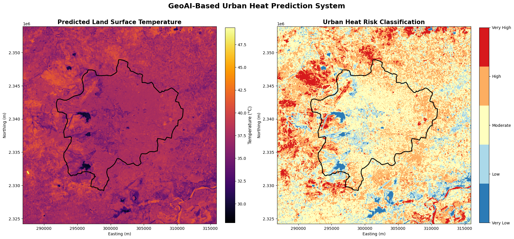

# GeoAI Based Urban Heat Island Prediction Using Earth Observation and Explainable Machine Learning

<p align="center">


</p>

An end-to-end **GeoAI workflow** for predicting **Urban Heat Island (UHI)** intensity using **Landsat satellite imagery**, **machine learning**, and **Explainable Artificial Intelligence (SHAP)**.

This project integrates **Earth Observation**, **Remote Sensing**, **Geospatial Data Science**, and **Explainable Machine Learning** to predict **Land Surface Temperature (LST)** and generate **Urban Heat Risk** maps for **Nagpur, India**.

The workflow is fully reproducible and organized into **five sequential Jupyter notebooks**, guiding the reader from satellite data acquisition through machine learning model development to GIS-ready spatial prediction products.

---

# Project Overview

Urban Heat Islands (UHIs) are one of the most significant environmental consequences of rapid urbanization. Expansion of impervious surfaces, reduction of vegetation cover, and changing landuse patterns increase surface temperatures, affecting human health, infrastructure, energy consumption, and climate resilience.

This project presents a complete **GeoAI framework** that combines Earth Observation with machine learning to investigate urban thermal environments.

The workflow integrates:

* Satellite Remote Sensing
* Geospatial Data Science
* Machine Learning
* Explainable Artificial Intelligence
* GIS-based Spatial Prediction

The resulting products include high-resolution Land Surface Temperature predictions, Urban Heat Risk classifications, explainable machine learning diagnostics, and GIS-ready raster outputs suitable for environmental planning and decision support.

---

<p align="center">

</p>

<p align="center">
<b>Figure 1.</b> GeoAI dashboard summarizing vegetation, built-up intensity, predicted land surface temperature, and urban heat risk across Nagpur.
</p>

---

# Why This Project Matters

Urban heat has become an increasingly important environmental and public health challenge worldwide.

Understanding where excessive heat occurs and why can support:

* Climate resilience planning
* Sustainable urban development
* Green infrastructure design
* Environmental monitoring
* Heat vulnerability assessment
* Evidence based policy making

By integrating satellite imagery with interpretable machine learning, this project demonstrates how GeoAI can support urban climate adaptation using freely available Earth Observation data.

---

# Research Questions

This project addresses three primary research questions:

1. **How accurately can satellite derived environmental variables predict urban Land Surface Temperature?**

2. **Which environmental variables contribute most strongly to urban heat patterns?**

3. **Can Explainable Artificial Intelligence improve the interpretation and transparency of Urban Heat Island prediction models?**

---

# Study Area

**Nagpur, Maharashtra, India**

Nagpur serves as an ideal case study because of its:

* Rapid urban expansion
* Extreme seasonal temperature variability
* Diverse land cover
* Increasing impervious surface development
* High Urban Heat Island potential

These characteristics provide an excellent environment for evaluating machine learning models designed to predict urban thermal patterns.

---

<p align="center">

</p>

<p align="center">
<b>Figure 2.</b> Municipal boundary of Nagpur, Maharashtra, India.
</p>

---

# Earth Observation Dataset

The project utilizes openly available satellite imagery obtained through the **Microsoft Planetary Computer**.

### Primary Dataset

* Landsat 8/9 Collection 2 Level-2 Surface Reflectance

### Derived Environmental Variables

* **Land Surface Temperature (LST)**
* **Normalized Difference Vegetation Index (NDVI)**
* **Normalized Difference Built-up Index (NDBI)**
* **Normalized Difference Water Index (NDWI)**

These variables represent vegetation, urban development, moisture conditions, and surface thermal characteristics used for machine learning.

---

# End-to-End GeoAI Workflow

```text
Study Area Definition
        │
        ▼
Satellite Data Acquisition
        │
        ▼
Remote Sensing Processing
        │
        ▼
Feature Engineering
(NDVI • NDBI • NDWI • LST)
        │
        ▼
Exploratory Spatial Data Analysis
        │
        ▼
Machine Learning
(Random Forest & XGBoost)
        │
        ▼
Explainable AI (SHAP)
        │
        ▼
Spatial Prediction
        │
        ▼
Urban Heat Risk Mapping
```
---

# Repository Structure

```text
urban-heat-geoai/
│
├── notebooks/
│   ├── 01_Study_Area_and_Project_Overview.ipynb
│   ├── 02_Data_Acquisition_and_Feature_Engineering.ipynb
│   ├── 03_Exploratory_Spatial_Data_Analysis.ipynb
│   ├── 04_Machine_Learning_Explainable_AI.ipynb
│   └── 05_GeoAI_Prediction_and_Spatial_Deployment.ipynb
│
├── data/
│   ├── raw/
│   └── processed/
│
├── models/
│
├── predictions/
│
├── figures/
│
├── README.md
├── requirements.txt
├── LICENSE
└── .gitignore
```

---

# Notebook Overview

## Notebook 1 — Study Area & Project Overview

Introduces the research problem, study area, Earth Observation datasets, and complete GeoAI workflow.

**Major Tasks**

* Project overview
* Research questions
* Study area definition
* Earth Observation datasets
* Workflow overview

---

## Notebook 2 — Data Acquisition & Feature Engineering

Acquires Landsat imagery from the Microsoft Planetary Computer and derives environmental predictor variables.

**Major Tasks**

* Landsat image retrieval
* Cloud filtering
* Annual median composite generation
* Feature engineering

Derived features include:

* Land Surface Temperature (LST)
* NDVI
* NDBI
* NDWI

---

## Notebook 3 — Exploratory Spatial Data Analysis

Builds the machine learning dataset and investigates relationships between environmental variables and urban temperature.

**Major Tasks**

* Raster validation
* Dataset creation
* Descriptive statistics
* Exploratory analysis
* Correlation analysis
* Spatial relationship assessment

<p align="center">

</p>

<p align="center">
<b>Figure 4.</b> Correlation matrix illustrating relationships between environmental variables and Land Surface Temperature.
</p>

---

## Notebook 4 — Machine Learning & Explainable AI

Develops, evaluates, and interprets machine learning models for predicting Land Surface Temperature.

Models evaluated:

* Random Forest Regressor
* XGBoost Regressor

Evaluation metrics include:

* R²
* MAE
* RMSE
* Residual Analysis
* Feature Importance

Explainability is achieved using SHAP to understand the contribution of each predictor variable to model predictions.
---

# Explainable Artificial Intelligence (SHAP)

Traditional machine learning models often function as "black boxes," making it difficult to understand how individual variables influence predictions. To improve transparency, this project integrates **SHapley Additive exPlanations (SHAP)** for model interpretation.

The SHAP analysis provides both **global** and **local** explanations of the trained model by quantifying the contribution of each predictor to the predicted Land Surface Temperature.

The explainability workflow includes:

* Global feature importance
* SHAP summary plots
* SHAP dependence plots
* Waterfall plots
* Force plots

These analyses help verify that the model's behaviour aligns with established urban climate principles.

<p align="center">

</p>

<p align="center">
<b>Figure 5.</b> SHAP summary plot showing the contribution of NDVI, NDBI, and NDWI to predicted Land Surface Temperature.
</p>

---

# Results

The trained machine learning model was deployed across the Nagpur study area to generate continuous predictions of **Land Surface Temperature (LST)** and classify urban heat into discrete risk categories.

## Key Results at a Glance

| Output               | Description                                             |
| ---------------------| ------------------------------------------------------- |
| Predicted LST        | Continuous Land Surface Temperature prediction          |
| Heat Risk Map        | Five-level Urban Heat Risk classification               |
| Explainable AI       | SHAP-based interpretation of model predictions          |
| Correlation Analysis | Statistical relationships among environmental variables |
| GIS Outputs          | GeoTIFF rasters ready for GIS analysis                  |
| Dashboard            | Integrated GeoAI visualization of model outputs         |

---

<p align="center">

</p>

<p align="center">
<b>Figure 6.</b> Predicted Land Surface Temperature (left) and corresponding Urban Heat Risk classification (right).
</p>

---

<p align="center">

</p>

<p align="center">
<b>Figure 7.</b> Integrated GeoAI dashboard summarizing environmental predictors and prediction outputs.
</p>

---

# Key Findings

The analysis identified several important spatial relationships between environmental variables and urban thermal patterns.

### Major Findings

* **Built-up intensity (NDBI)** was the strongest predictor of urban surface temperature.
* **Vegetation (NDVI)** consistently reduced predicted temperatures, demonstrating its cooling influence.
* **Surface moisture (NDWI)** contributed additional environmental information but had a smaller influence than vegetation and built-up intensity.
* Explainable AI confirmed that the machine learning model behaves consistently with established urban climate theory.
* The workflow successfully produced GIS ready prediction products suitable for environmental planning and urban heat assessment.

---

# Technologies Used

## Programming

* Python

## Geospatial Analysis

* GeoPandas
* Rasterio
* Rioxarray
* Xarray
* Stackstac
* Shapely
* OSMnx

## Machine Learning

* Scikit-learn
* XGBoost
* SHAP

## Earth Observation

* Microsoft Planetary Computer
* STAC API
* Landsat 8/9 Collection 2 Level-2

## Visualization

* Matplotlib
* Plotly

---

# Installation

Clone the repository:

```bash
git clone https://github.com/ShreyaJari/urban-heat-geo.git
```

Navigate to the project directory:

```bash
cd urban-heat-geoai
```

Install the required dependencies:

```bash
pip install -r requirements.txt
```

---

# Usage

Run the notebooks sequentially:

1. **Notebook 1:** Study Area & Project Overview
2. **Notebook 2:** Data Acquisition & Feature Engineering
3. **Notebook 3:** Exploratory Spatial Data Analysis
4. **Notebook 4:** Machine Learning & Explainable AI
5. **Notebook 5:** GeoAI Spatial Deployment

Each notebook builds upon the outputs generated in the previous notebook.

---

# Generated Outputs

The workflow produces the following outputs:

* Land Surface Temperature raster (`predicted_lst.tif`)
* Urban Heat Risk raster (`heat_risk_classes.tif`)
* Machine learning models
* Prediction summary tables
* GIS ready GeoTIFF files
* SHAP explainability plots

---

# Future Improvements

Potential extensions of this work include:

* Multi temporal Urban Heat Island monitoring
* Integration of Sentinel-2 imagery for higher spatial resolution
* Incorporation of meteorological variables (air temperature, humidity, wind speed)
* Inclusion of urban morphology indicators such as building height, road density, and population density
* Deep learning approaches (CNNs, U-Net)
* Interactive Web GIS deployment
* Real time environmental monitoring using cloud computing platforms

---

# Skills Demonstrated

This project demonstrates expertise in:

* Earth Observation
* Remote Sensing
* Geographic Information Systems (GIS)
* Geospatial Data Science
* Machine Learning
* Explainable Artificial Intelligence (SHAP)
* Spatial Statistics
* Urban Climate Analysis
* Python Programming
* Raster Processing
* Satellite Image Analysis
* Environmental Data Analytics

---

# Citation

If you use this repository in your research or teaching, please cite it as:

```text
Jariwala, S. (2026).

GeoAI-Based Urban Heat Island Prediction Using Earth Observation
and Explainable Machine Learning.

GitHub Repository:
https://github.com/ShreyaJari/urban-heat-geo
```

---

# Acknowledgements

This project utilizes open datasets and open source software from the following organizations and communities:

* Microsoft Planetary Computer
* Landsat 8/9 Collection 2 Level-2
* OpenStreetMap
* Scikit-learn
* XGBoost
* SHAP
* GeoPandas
* Rasterio
* Stackstac
* Xarray

Their contributions have made reproducible geospatial and machine learning research more accessible to the scientific community.

---

# Author

**Shreya Jariwala**

**M.S. GeoData Science**

**Geodata Consultant**

This repository was developed as part of my GeoAI portfolio, demonstrating the integration of Earth Observation, geospatial analytics, machine learning, and Explainable AI for urban climate applications.

**Connect with me**

* LinkedIn: *(https://www.linkedin.com/in/shreya-jariwala-61681a171/)*
* GitHub: https://github.com/ShreyaJari

---

# License

This project is licensed under the **MIT License**.

See the `LICENSE` file for additional details.

---

## If you found this project useful, consider giving the repository a star!

Feedback, suggestions, and contributions are always welcome.
